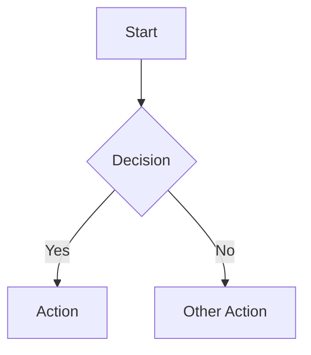
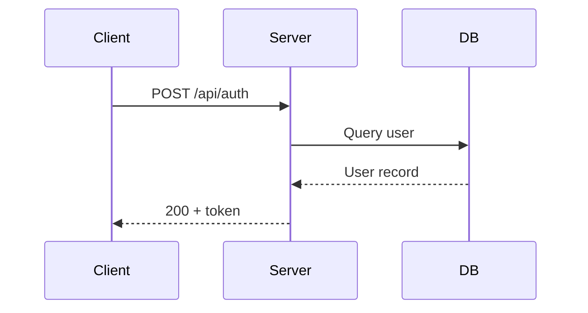
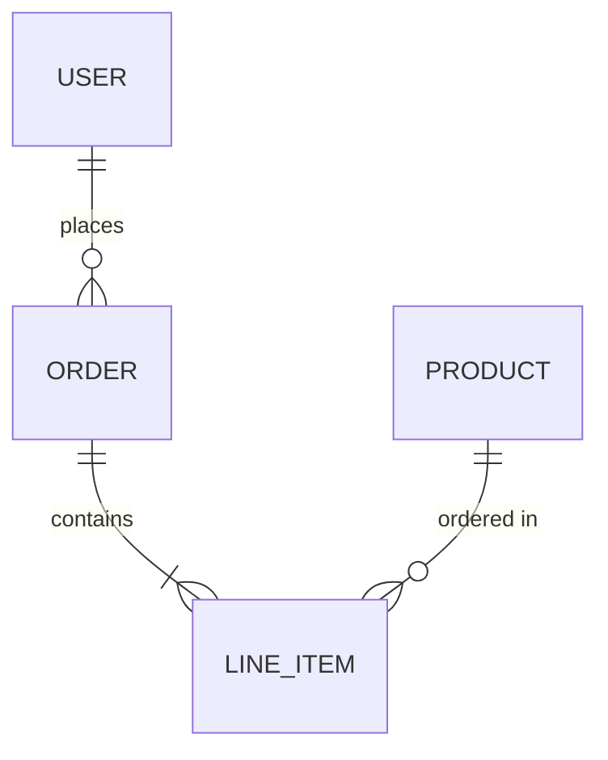
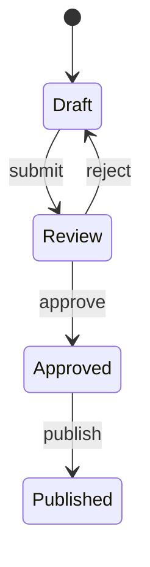
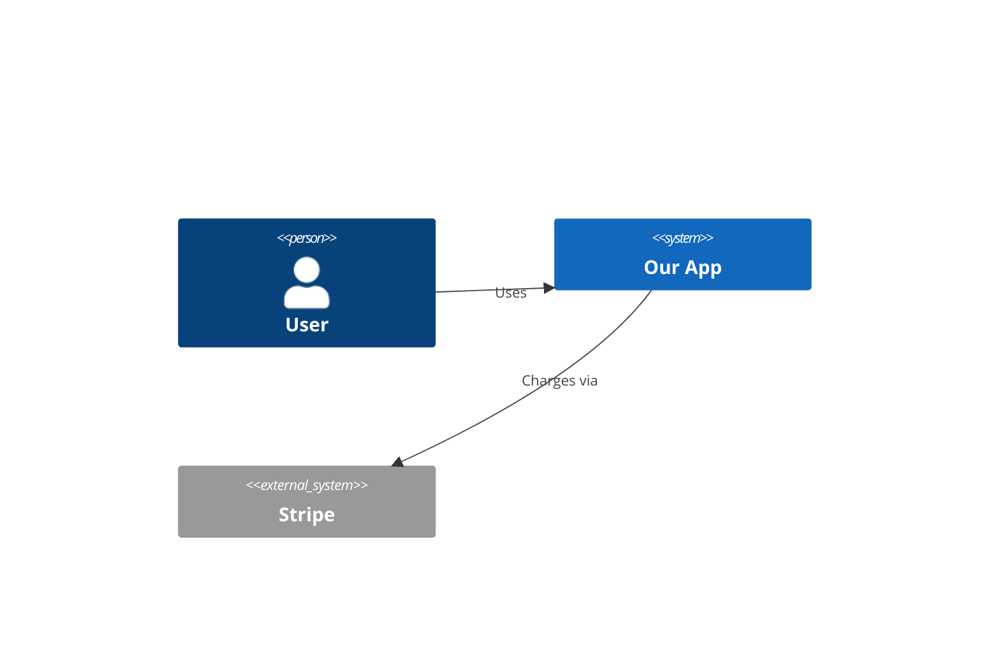

# Diagram — English to Visual

## When to Invoke

Use when you need to visualize architecture, data flows, sequences, state machines, or any system relationship. Produces mermaid source that renders in GitHub, docs, and most markdown viewers.

## Diagram Types

### Flowchart (decision logic, processes)


### Sequence Diagram (API calls, interactions)


### Entity Relationship (data models)


### State Diagram (state machines)


### C4 Architecture (system context)


## Workflow

### Step 1: Understand the Request

Ask if unclear:
- What are the entities/actors?
- What are the relationships/flows?
- What level of detail? (high-level overview vs. detailed implementation)
- Where will this be displayed? (README, docs, slides)

### Step 2: Choose Diagram Type

| If showing... | Use... |
|---------------|--------|
| Process/logic flow | Flowchart |
| API/component interactions | Sequence Diagram |
| Data model relationships | ER Diagram |
| State transitions | State Diagram |
| System architecture | C4 Context/Container |
| Timeline/phases | Gantt |
| Class structure | Class Diagram |

### Step 3: Generate

1. Write the mermaid source
2. Keep it readable — max 15-20 nodes per diagram (split if larger)
3. Use clear, short labels
4. Group related nodes with subgraphs where helpful

### Step 4: Deliver

Output the mermaid source in a fenced code block. Also suggest where to save it:

- In a doc: embed directly in markdown
- Standalone: save as `.md` file with just the diagram
- For export: suggest tools like `mmdc` (mermaid CLI) for SVG/PNG

## Output

```markdown
## Diagram Generated

**Type**: [flowchart/sequence/ER/state/C4]
**Entities**: [count]
**File**: [where saved, if applicable]
```

Plus the mermaid source ready to copy.

## Principles

- One diagram, one concept — don't cram everything into one visual
- If it needs more than 20 nodes, split into multiple diagrams at different zoom levels
- Labels should be readable without context — no abbreviations unless universal
- Direction matters: top-down for hierarchies, left-right for flows
- Color sparingly — only to highlight the important path or distinction
